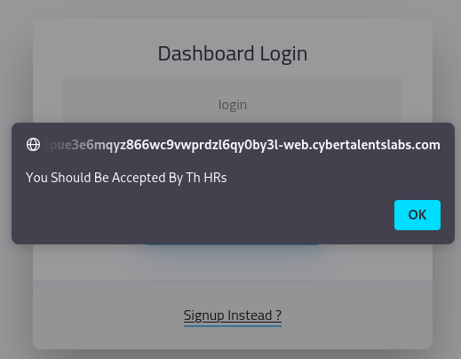
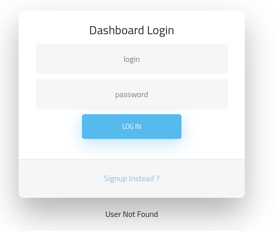
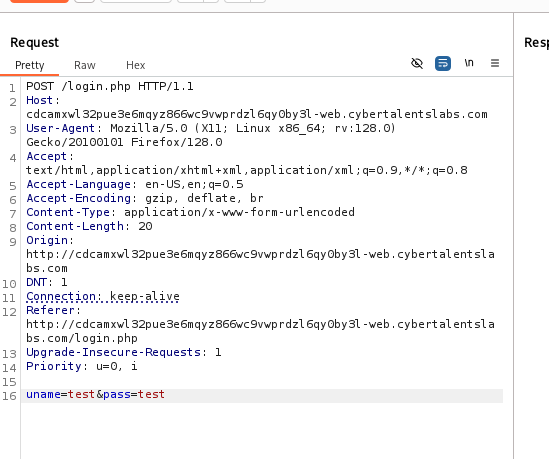
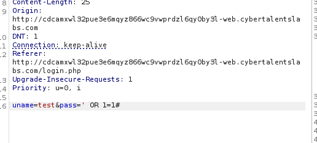
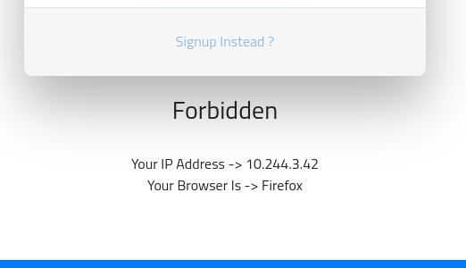
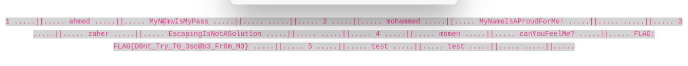

## CatchMomen write up
When opening the challenge the first thing visible is  the landing home page.
In the Nav section there is a link to the log in page.

Clicking the sign up page proved futile as 

The next instinct was to try some arbitrary credentials and see the request in burp

burp request

Nothing unusual just a user not found message
However putting the famous `' OR 1=1 -- ` payload brought something interesting

response

This implied the server was doing some filtering on the request
removing the `OR`and replacing it with `||`still brought the same error
turns out the server the server was checking for the existance of all the charaters from `OR 1=1`
the fix was to replace:

   `OR` with `||`
   `1=1` with any other statement that equates to true in this case `2 != 3`
   the final payload was `' OR 2!=3 -- `
   
   

