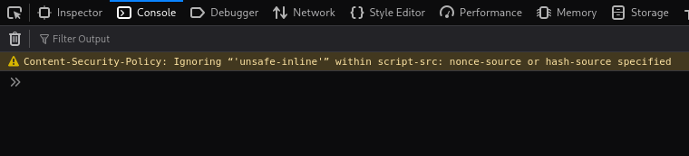

# Report: Content Security Policy Bypass (Static Nonce) Level:Medium

## 1. Introduction

This report details the successful bypass of a Content Security Policy (CSP) implemented in the DVWA within a Capture The Flag (CTF) challenge. The vulnerability exploited was the use of a static, predictable nonce value within the `script-src` directive, which allowed for the execution of arbitrary inline JavaScript.

## 2. Vulnerability Description

Content Security Policy (CSP) is a security mechanism designed to mitigate various types of attacks, including Cross-Site Scripting (XSS), by specifying trusted sources of content that a web browser should be allowed to load and execute for a given page. The `script-src` directive within CSP controls which JavaScript sources are permitted.

In this context the DVWA implemented the following `Content-Security-Policy` header:

`Content-Security-Policy: script-src 'self' 'unsafe-inline' 'nonce-TmV2ZXIgZ29pbmcgdG8gZ2l2ZSB5b3UgdXA=';`

While this policy attempts to restrict script execution, it contains a critical flaw: the `nonce-TmV2ZXIgZ29pbmcgdG8gZ2l2ZSB5b3UgdXA=` value is **static and predictable**. A properly implemented CSP nonce must be a cryptographically secure, random string generated uniquely for each HTTP response. The re-use of a fixed nonce value renders the nonce protection ineffective.

Additionally, the presence of `'unsafe-inline'` in the `script-src` directive is generally a security risk. However, in modern browsers, when a `nonce` (or `hash`) is also specified, the `'unsafe-inline'` keyword for script tags is typically ignored, as the nonce is considered a stronger, more granular control. This was confirmed by browser console messages observed during initial testing:


`Content-Security-Policy: Ignoring “'unsafe-inline'” within script-src: nonce-source or hash-source specified`

Attempts to bypass using `javascript:` URIs were also blocked by the browser's strict interpretation of CSP, even with `'unsafe-inline'` present.

## 3. Bypass Method

The bypass was achieved by leveraging the static nature of the nonce. Since the nonce value was constant and known (`TmV2ZXIgZ29pbmcgdG8gZ2l2ZSB5b3UgdXA=` - the Base64 decoding of "Never going to give you up"), an attacker could craft an inline `<script>` tag with this exact nonce value.

**Steps to bypass:**

1.  **Identify the Static Nonce:** Through observation of the `Content-Security-Policy` header of the http response, the static nonce value `TmV2ZXIgZ29pbmcgdG8gZ2l2ZSB5b3UgdXA=` was identified. It was crucial to note that the `nonce-` prefix is part of the CSP header directive's syntax, but not part of the value expected in the HTML `nonce` attribute.
    
2.  **Craft Malicious Payload:** An inline `<script>` tag was created, including the identified static nonce value in its `nonce` attribute.
    
    ```
    <script nonce='TmV2ZXIgZ29pbmcgdG8gZ2l2ZSB5b3UgdXA='>
        alert('Vulnerability Found');
    </script>
    
    ```
    
3.  **Inject Payload:** This payload was injected into the input field.
    
4.  **Execution:** Upon rendering the page, the browser correctly parsed the injected `<script>` tag. It compared the `nonce` attribute's value with the `nonce` specified in the `Content-Security-Policy` header. Since they matched exactly, the browser allowed the inline script to execute, leading to the `alert('Vulnerability Found');` pop-up.
    

## 4. Impact

The successful bypass of the Content Security Policy demonstrates a critical Cross-Site Scripting (XSS) vulnerability. An attacker could:

-   Execute arbitrary JavaScript in the context of the vulnerable web page.
    
-   Steal user session cookies (e.g., `document.cookie`).
    
-   Perform actions on behalf of the user (e.g., change passwords, make purchases).
    
-   Deface the website or redirect users to malicious sites.
    
-   Phish for credentials.
    

This vulnerability undermines the intended security benefits of CSP, leaving users exposed to various client-side attacks.

## 5. Mitigation

To properly secure the application and prevent this bypass, the following steps are essential:

1.  **Randomize Nonce Per Request:** The nonce value **must** be a cryptographically secure random string generated uniquely for _every single HTTP response_. This ensures that an attacker cannot predict or re-use a nonce from a previous request.
    
2.  **Avoid `'unsafe-inline'`:** While modern browsers ignore `'unsafe-inline'` when a nonce is present for script tags, it's still best practice to remove it from the CSP. It can lead to confusion and might be interpreted by older browsers or in different contexts in ways that re-introduce vulnerabilities.
    
3.  **Strict CSP:** Aim for a strict CSP that relies on nonces (for dynamic inline content) or hashes (for static inline content) and whitelists specific external domains, avoiding broad directives like `'unsafe-inline'` or wildcards (`*`).
    
4.  **Input Validation and Output Encoding:** As a primary defense, all user-supplied input should be rigorously validated, and all output rendered to the HTML should be properly encoded to prevent any form of HTML or JavaScript injection. CSP acts as a defense-in-depth, not a replacement for these fundamental security practices.
    

## 6. Conclusion

The CSP challenge effectively highlighted a common misconfiguration in Content Security Policies: the use of a static nonce. This flaw allowed for a straightforward bypass, demonstrating how a seemingly robust security measure can be rendered ineffective by a single, predictable value. Proper implementation of CSP, particularly the dynamic generation of nonces, is crucial for effective XSS mitigation.


  * **Priority:** **High**. Due to the potential impact, this vulnerability should be addressed immediately.
  
  **Reporter Information:**

  * **Name:** Henry Mate Security Analyst
  * **Date Discovered:** July 10, 2025

**References:**
* 

